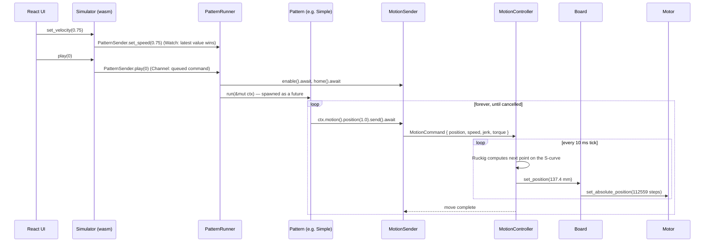

# 00 — Overview

## What this project is

Firmware for a linear actuator (a belt-driven carriage on a rail, pushed by a
servo motor), plus the tooling around it. Written in Rust, targeting ESP32 and
ESP32-S3 microcontrollers — and, because the core is platform-agnostic, also
targeting WebAssembly so the same firmware logic runs in a browser.

If you have written Qt-on-embedded-Linux, the closest analogy is: a hard
real-time control loop, a device driver stack under it, a "business logic"
layer above it, and several UI frontends that talk to it over a transport.
The difference is that there is no OS here — no Linux, no threads, no
`malloc` in the hot path. Everything runs on a cooperative async executor on
bare metal.

## The physical picture

```
   home end                                          far end
      |                                                 |
      |====[ carriage ]=================================|   rail, ~200 mm of travel
             ^
             belt  →  20-tooth pulley, 2 mm pitch  →  40 mm per motor revolution
                      motor: 32768 steps per revolution
```

So one millimetre of travel is 819.2 motor steps. Nothing above the board
layer knows that number; see [11-trajectory-planning.md](11-trajectory-planning.md).

## Layer cake

```
┌──────────────────────────────────────────────────────────────┐
│  Frontends: BLE remote, M5 ESP-NOW remote, browser UI        │
│  → they only ever produce PatternCommands and input values   │
├──────────────────────────────────────────────────────────────┤
│  pattern-engine  (crates/pattern-engine)                     │
│  "what motion to perform" — Simple, Stop'n'Go, Teasing, ...  │
├──────────────────────────────────────────────────────────────┤
│  ossm  (ossm/)                                               │
│  MotionSender  ──channel──▶  MotionController               │
│  "how to get there safely" — state machine + Ruckig planning │
├──────────────────────────────────────────────────────────────┤
│  Board  (boards/rs485, boards/stepdir, boards/sim-board)     │
│  "put the carriage at 137.4 mm" → steps                      │
├──────────────────────────────────────────────────────────────┤
│  Motor  (drivers/m57aim, drivers/sim-motor)                  │
│  "write 112 559 to the position register"                    │
├──────────────────────────────────────────────────────────────┤
│  Transport (Modbus RTU over RS-485 UART, or STEP/DIR GPIO)   │
└──────────────────────────────────────────────────────────────┘
```

Each layer only knows the one below it through a **trait** — Rust's
equivalent of a pure-virtual interface, but resolved at compile time with
zero indirection. See [rust/02-traits-and-generics.md](rust/02-traits-and-generics.md).
That is what lets the top three layers be reused unchanged in the browser,
where the bottom three are replaced by a two-file fake.

## Flow of information: slider to motor

Follow one movement all the way down. This is the browser path; the hardware
path is identical above the `Board` line.



Three things to notice, because they explain most of the architecture:

1. **The pattern never controls the motor directly.** It says "go to the far
   end", and the motion controller decides the acceleration curve that gets
   there without exceeding the jerk limit. A pattern physically cannot
   command an unsafe move.
2. **The 10 ms tick is the heartbeat.** On hardware it runs on a
   high-priority interrupt executor on the second CPU core; in the browser it
   is a `setTimeout`-backed ticker. Everything else is best-effort around it.
3. **Nothing shares memory.** Every arrow between boxes is a channel, a
   signal, or a watch — small lock-free primitives from Embassy. See
   [rust/04-async-and-embassy.md](rust/04-async-and-embassy.md).

## The three coordinate systems

A recurring source of confusion, so it is worth pinning down early:

| Layer | Units | Example |
| --- | --- | --- |
| Pattern / UI | fraction of the *stroke window* (0.0–1.0) | `position(1.0)` = deepest point of the current stroke |
| `MotionCommand` | fraction of the *machine range* (0.0–1.0) | `position: 0.62` |
| `MotionController` internals, `Board` | millimetres | `137.4` |
| `Motor`, transport | steps / register values | `112559` |

`depth` and `stroke` (user inputs) are what map the first row to the second;
`MotionLimits` maps the second to the third; `MechanicalConfig` maps the
third to the fourth.

## Where the code lives

```
ossm/                      the core, no_std, platform-agnostic
crates/pattern-engine/     patterns + engine, no_std
crates/ble-remote/         BLE GATT server (ESP-only)
crates/ossm-m5-remote/     ESP-NOW remote protocol (ESP-only)
crates/ossm-flash/         host-side CLI: build + flash + monitor
drivers/m57aim/            the real servo motor driver
drivers/sim-motor/         a fake motor: an i32 and a bool
boards/rs485/              Board impl for RS-485 motors
boards/stepdir/            Board impl for STEP/DIR motors
boards/sim-board/          Board impl for the fake motor
ossm-esp/                  ESP-HAL glue: UART, GPIO matrix, feature-gated wiring
firmware/esp32s3/          ESP32-S3 binaries: ossm-alt, waveshare, seeed-xiao
firmware/esp32/            ESP32 binary: ossm-reference
bindings/web-simulator/    WASM: the firmware, in a browser tab
bindings/trajectory-recorder/  WASM: headless planner, for the graphs
apps/web-tools/            React app hosting both WASM modules
apps/docs/                 the documentation site
```

Note that `firmware/*`, `ossm-esp/`, and `bindings/*` each declare their own
`[workspace]` and are therefore **not** part of the root Cargo workspace.
That is deliberate — each targets a different architecture. See
[rust/06-cargo-and-builds.md](rust/06-cargo-and-builds.md).

## Where to go next

- The core control layer: [10-core-ossm.md](10-core-ossm.md)
- The simulator you asked about: [20-wasm-simulator.md](20-wasm-simulator.md)
- The ALT hardware variant: [30-ossm-alt.md](30-ossm-alt.md)
